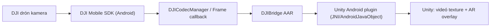

# DJIBridge

Android (Kotlin) bridge library **AAR-ként** Unity-hoz: a **DJI Mobile SDK** élő videó feed-jét (és opcionálisan telemetriát) kiteszi egy Unity-ből hívható Android plugin API-n keresztül.

> Használat nálam: ezt a projektet **.aar**-ként build-elem, majd az AAR-t bemásolom ide:
>
> `DJIUnity/Assets/Plugins/Android/`
>
> …és a későbbi `DJIUnity` Unity applikáció innen veszi fel dependency-ként.

---

## Mi ez, és hova illeszkedik?

A teljes pipeline jellemzően így néz ki:



**DJIBridge** felel azért, hogy:
- a DJI SDK-ból érkező **live video** adatfolyamot fogadja,
- (tipikusan) **dekódolja** és frame-eket állítson elő,
- a frame-eket egy Unity által hívható (JNI) felületre tegye ki.

---

## Követelmények

### Fejlesztői környezet
- Android Studio / Gradle
- Android SDK + megfelelő build tools
- (Opcionális) NDK, ha van natív (C/C++) rész

### DJI oldal
- DJI fejlesztői fiók + **API key** (Mobile SDK aktiváláshoz)
- DJI Mobile SDK (MSDK) hozzáadva a projekthez (Gradle dependency vagy lokális AAR-ok)

---

## Gyors start (AAR build)

1) **Nyisd meg** a projektet Android Studio-ban.

2) Ellenőrizd, hogy a modul **Android Library**:
- `com.android.library` plugin
- `android { ... }`

3) Build AAR:

**macOS/Linux**
```bash
./gradlew :app:assembleRelease
```

**Windows**
```bat
gradlew.bat :app:assembleRelease
```

> Ha a modul neve nem `app`, cseréld ki a megfelelőre (pl. `:bridge:assembleRelease`).

4) Kimenet (tipikusan):
```text
app/build/outputs/aar/
  app-release.aar
```

---

## Unity integráció

### 1) AAR bemásolása
Másold be a buildelt AAR-t ide:

```text
DJIUnity/Assets/Plugins/Android/
  DJIBridge.aar   (vagy app-release.aar átnevezve)
```

Unity-ben:
- Jelöld ki az AAR assetet
- Inspector → **Select platforms for plugin** → Android bepipál
- Apply

> Unity dokumentáció (Unity 6): AAR plug-in import és működés  
> https://docs.unity3d.com/6000.3/Documentation/Manual/android-aar-import.html

### 2) Transitive dependency-k (fontos!)
A Unity általában **nem kezeli automatikusan** úgy a transitive dependency-ket, mint egy tiszta Android Studio projekt.
Ha az AAR **nem “fat AAR”**, és külön DJI/AndroidX/egyéb libek kellenek, két tipikus megoldás van:

**A) Unity Gradle template-ben felvenni a dependency-ket**
Unity 6: Gradle template-ek:  
https://docs.unity3d.com/6000.3/Documentation/Manual/gradle-templates.html

- Project Settings → Player → Android → Publishing Settings
- Pipáld be:
  - Custom Main Gradle Template
  - Custom Launcher Gradle Template
  - (ha kell) Custom Gradle Properties Template

Majd a `Assets/Plugins/Android/mainTemplate.gradle` / `launcherTemplate.gradle` fájlokban vedd fel a szükséges `repositories {}` és `dependencies {}` blokkokat.

**B) External Dependency Manager (EDM4U)**
Ha szeretnél Maven dependency-ket “Unity-kompatibilisen” kezelni, sokan EDM4U-val oldják meg.

---

## Android permissionök & manifest

A DJI SDK általában több permissiont igényel (network, wifi state, location, storage, stb.). Példa-lista és minta manifest a DJI dokumentációban:  
https://developer.dji.com/doc/mobile-sdk-tutorial/en/quick-start/run-sample.html

**Android 6+ (API 23+)** esetén a runtime permission kérést is kezelned kell (Unity Activity-ből vagy a pluginból).

---

## Tipikus Unity oldali hívás (példa)

> A konkrét class/package/method neveket igazítsd a DJIBridge implementációdhoz.  
> A minta csak a “hogyan hívd JNI-n át” sémát mutatja.

```csharp
using UnityEngine;

public class DJIBridgeClient : MonoBehaviour
{
    AndroidJavaObject _activity;
    AndroidJavaObject _bridge;

    void Start()
    {
#if UNITY_ANDROID && !UNITY_EDITOR
        var unityPlayer = new AndroidJavaClass("com.unity3d.player.UnityPlayer");
        _activity = unityPlayer.GetStatic<AndroidJavaObject>("currentActivity");

        // TODO: cseréld ki a saját fully-qualified class nevedre
        _bridge = new AndroidJavaObject("com.yourcompany.djibridge.DJIBridge");

        // Tipikus init
        _bridge.Call("initialize", _activity);
        _bridge.Call("registerSdk");      // DJI SDK regisztráció + aktiválás
        _bridge.Call("startVideoFeed");   // VideoFeeder feliratkozás / decode indítás
#endif
    }

    void OnDestroy()
    {
#if UNITY_ANDROID && !UNITY_EDITOR
        if (_bridge != null)
        {
            _bridge.Call("stopVideoFeed");
            _bridge.Call("shutdown");
        }
#endif
    }
}
```

---

## Videó pipeline röviden (DJI oldal)

A DJI Android SDK-ban a live videó kezeléshez tipikusan ezek a komponensek vannak:
- `VideoFeeder` – live video feed menedzsment
- `DJICodecManager` – dekódolás (és callbackek)
- `YuvDataCallback` – YUV frame callback (ha raw frame kell)

Doksi:
- VideoFeeder: https://developer.dji.com/api-reference/android-api/BaseClasses/DJIVideoFeeder.html
- DJICodecManager: https://developer.dji.com/api-reference/android-api/Components/CodecManager/DJICodecManager.html
- YuvDataCallback: https://developer.dji.com/api-reference/android-api/Components/CodecManager/DJICodecManager_YuvDataCallbackInterface.html

---

## Gyakori hibák / troubleshooting

### 1) `NoClassDefFoundError` Unity build/run közben
**Ok:** hiányoznak transitive dependency-k (AndroidX/Play Services/stb.).  
**Fix:** tedd be a hiányzó dependency-ket a Unity Gradle template-be, vagy csinálj “fat AAR”-t, vagy EDM4U.

### 2) Fekete kép / nincs render
Előfordulhat, hogy ha a videó adat “kimegy” egy YUV callbackbe, akkor a DJI FPV widget / default render nem kap adatot.
Ilyenkor a saját megjelenítésednek kell a frame-et kirajzolni.

### 3) Permission / aktiválás gondok
- ellenőrizd a manifestet
- runtime permission kérést
- DJI API key-t
- első indításkor network kellhet aktiváláshoz

---

## Release / verziózás

Javaslat:
- tarts `VERSION_NAME` / `VERSION_CODE` mezőket a Gradle configban
- minden új AAR buildnél bumpold a verziót, és nevezd el az AAR-t pl.:
  - `djibridge-0.3.0.aar`
- Unity oldalon így könnyebb visszagörgetni.

---

## Licenc

Add meg a licencet (MIT/Apache-2.0/stb.), és tedd be a `LICENSE` fájlt a repo gyökerébe.

---

## Kapcsolódó projektek

- DJIUnityNative – natív Unity plugin réteg (ha használsz C/C++ textúra frissítést)
- DJIUnity – Unity projekt, ami ezt az AAR-t fogyasztja
