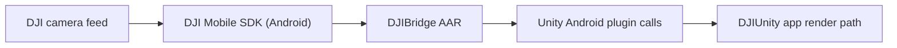

# DJIBridge

Android Kotlin bridge library built as an AAR for the Unity app. It integrates the DJI Mobile SDK, receives the live video stream, and exposes a Unity-callable Android plugin API.

The usual workflow is:

- build `DJIBridge` as an AAR
- copy the AAR into `DJIUnity/Assets/Plugins/Android/`
- rebuild the Unity Android app

---

## Role In The System


```mermaid
flowchart LR
  A["DJI camera feed"] --> B["DJI Mobile SDK (Android)"]
  B --> C["DJIBridge AAR"]
  C --> D["Unity Android plugin calls"]
  D --> E["DJIUnity app render path"]
```

`DJIBridge` is responsible for:

- initializing and registering the DJI Mobile SDK
- connecting the decoded video pipeline to a `Surface`
- exposing Unity-facing entry points through static Android/Kotlin APIs

---

## Requirements

- Android Studio / Gradle
- Android SDK
- DJI developer account
- DJI Mobile SDK dependencies available to Gradle

---

## DJI API Key Setup

Do not hardcode the DJI API key in source files.

The project now reads the key from one of these locations:

1. `DJIBridge/local.properties`
2. Gradle property: `-PDJI_API_KEY=...`
3. Environment variable: `DJI_API_KEY`

Recommended local setup:

1. Copy `local.properties.example` to `local.properties` if needed.
2. Add your SDK path and DJI key there.

Example:

```properties
sdk.dir=C\:\\Users\\you\\AppData\\Local\\Android\\Sdk
DJI_API_KEY=your-dji-api-key
```

Important:

- `local.properties` is gitignored
- `local.properties.example` is safe to commit
- the Android manifest receives the key through a Gradle manifest placeholder

If the key was ever committed previously, treat it as exposed and rotate it in the DJI developer portal.

---

## Build

Open the project in Android Studio or build with Gradle.

Windows:

```bat
gradlew.bat assembleRelease
```

macOS/Linux:

```bash
./gradlew assembleRelease
```

Output:

```text
build/outputs/aar/DJIUnityBridge.aar
```

---

## Unity Integration

Copy the built AAR here:

```text
DJIUnity/Assets/Plugins/Android/DJIUnityBridge.aar
```

Then rebuild the Unity Android app.

---

## Registration Notes

The DJI SDK registration only succeeds if all of these match:

- the `DJI_API_KEY`
- the Android package name of the built Unity app
- the signing certificate used to sign the APK/AAB

Current Unity package name in this workspace:

```text
com.sok9hu.djibridge
```

If the DJI developer portal is configured for a different package name or certificate, registration will fail and no video feed will appear.

---

## Troubleshooting

### `onRegisterFailure: The metadata received from server is invalid`

This usually means a DJI registration mismatch, not a rendering bug.

Check:

- the API key value
- the Unity Android package name
- the signing certificate configured on the DJI side

### No video, black screen

If the Unity side renders the external texture but no frames arrive:

- confirm DJI SDK registration succeeded
- confirm product connection succeeded
- confirm the RC/phone USB accessory is visible and permission is granted

### Missing Android dependencies in Unity

If Unity runtime/build errors mention missing Android classes:

- verify the Unity Gradle templates include the required repositories and dependencies
- verify the correct AAR was copied into `Assets/Plugins/Android`

---

## Related Projects

- `DJIUnityNative`: native render-thread plugin for OES texture updates
- `DJIUnity`: main Unity Android application
